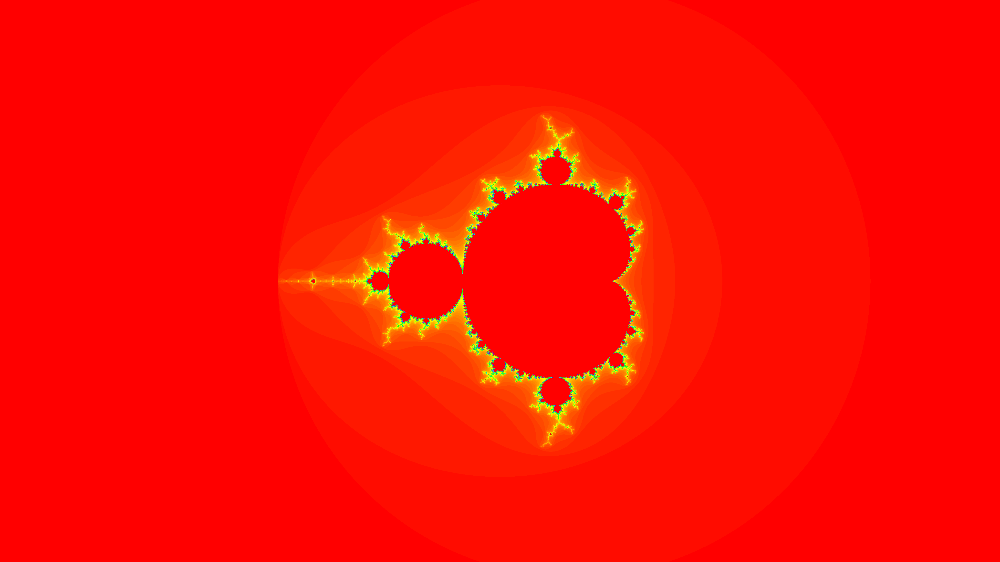
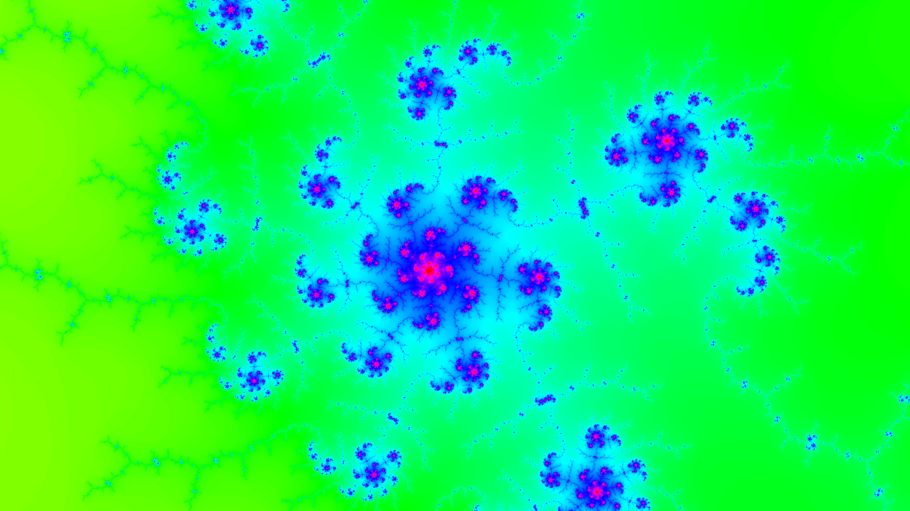

# Mandelbrot explorer

A simple mandelbrot explorer.

## Modes

### Simple generator
Use one thread, very basic.

### Thread pool generator
Divide the screen in square of size 64 and process them in different thread. The number of the thread is the number of processor. 
Use the ThreadPoolExecutor object.

### Fork/Join generator
Same, but with a fork/join pool and recursive action

## Control

* Move: drag with left mouse button
* Zoom in: right mouse button
* Zoom out: shift + right mouse button

## Samples

